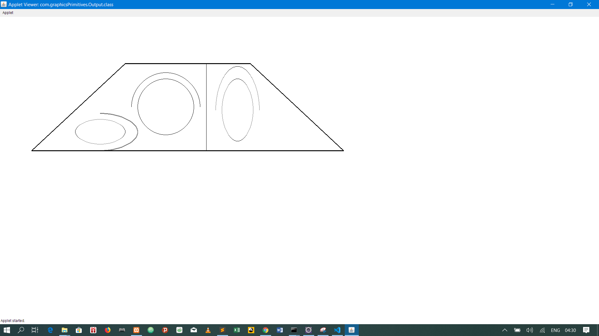
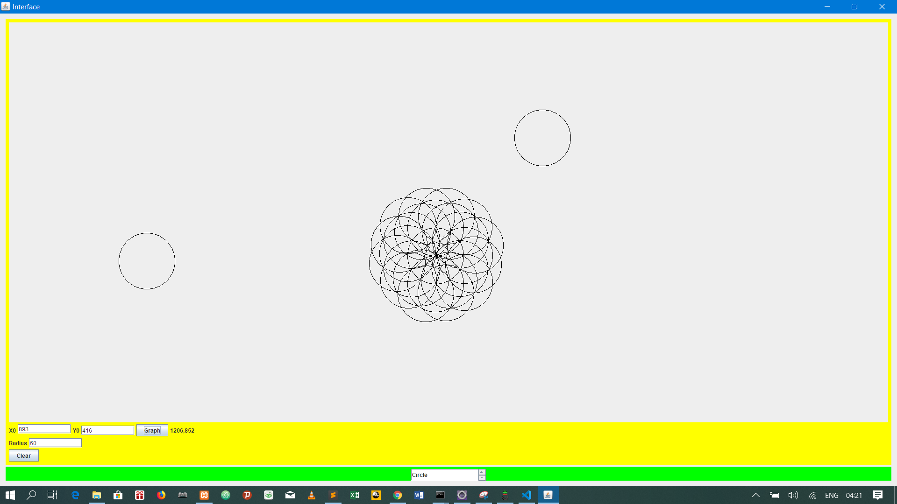

This project was constructed in java while taking the computer graphics course for cs majors

It includes code for drawing circles and line (bresenham, vertical, horizontal, positive and negative gradient lines)

An implementation of the flood fill algorithm was utilized in parts of this project which was challenging

It also includes codes for various transformations, class and homework assignment projects

fun times.

/Todo: more descriptions on the various projects and how to run them

